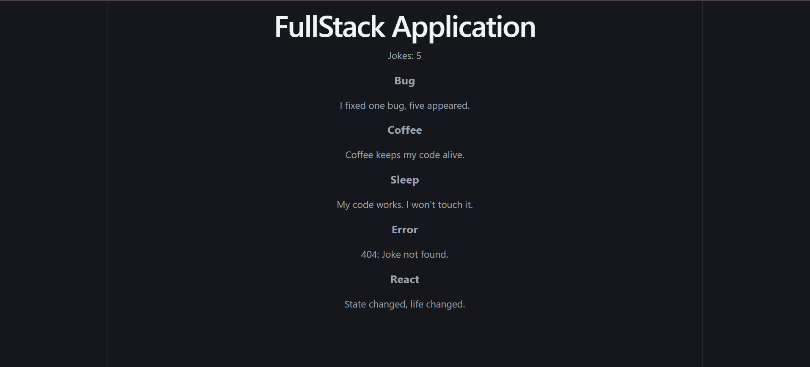

# 🚀 Learning: Connecting Frontend & Backend (React + Express)

> My first full-stack learning project where I connected a React frontend with an Express backend while understanding how client-server communication works using REST APIs, Axios, HTTP requests, Vite Proxy, CORS, and React Hooks.

---

# 📖 About the Project

This project was built as my **first hands-on full-stack application**.

The objective wasn't to build a complex application, but to understand how a frontend communicates with a backend.

The Express server exposes a REST API that returns a list of jokes, while the React frontend fetches and renders them dynamically using Axios.

During this project I learned not just how to connect React with Express, but also the concepts that make the communication possible behind the scenes.

---

# 🖥️ Project Preview



---

# 🛠️ Tech Stack

### Frontend
- React
- Vite
- Axios
- CSS

### Backend
- Node.js
- Express.js

---

# 📁 Project Structure

```
Learning-Connecting-Frontend-Backend-Mini-Project
│
├── frontend
│   ├── src
│   ├── public
│   ├── vite.config.js
│   └── package.json
│
├── backend
│   ├── server.js
│   └── package.json
│
├── assets
│   └── FullStack_Final_Working.png
│
└── README.md
```

---

# ✨ Features

- Built an Express backend
- Created REST API endpoints
- Connected React frontend to backend
- Used Axios to fetch API data
- Displayed dynamic data using React
- Implemented Vite Proxy
- Understood Client-Server Architecture
- Learned complete request-response flow

---

# 📡 API Endpoint

## GET `/api/jokes`

Returns a list of jokes.

Example Response

```json
[
  {
    "id": 1,
    "title": "Bug",
    "content": "I fixed one bug, five appeared."
  },
  {
    "id": 2,
    "title": "Coffee",
    "content": "Coffee keeps my code alive."
  }
]
```

---

# 💻 Frontend Concepts Learned

- React Components
- JSX
- useState()
- useEffect()
- map()
- State Management
- Component Re-rendering
- Dynamic Rendering
- Keys in React Lists

---

# ⚙️ Backend Concepts Learned

- Express.js
- Creating a Server
- API Routes
- GET Requests
- Response Handling
- JSON Responses
- Express Routing

---

# 🌐 Networking Concepts Learned

- Client
- Server
- Frontend
- Backend
- HTTP
- Request
- Response
- REST API
- JSON
- Client-Server Architecture

---

# 📨 Axios

Learned how Axios simplifies HTTP requests.

Instead of writing

```javascript
fetch(...)
```

I used

```javascript
axios.get(...)
```

### Advantages

- Cleaner syntax
- Automatic JSON parsing
- Better error handling
- Promise-based API

---

# 🔒 CORS (Cross-Origin Resource Sharing)

Learned:

- What CORS is
- Why browsers block cross-origin requests
- Why browser security is important
- Why different ports are considered different origins

Example

```
Frontend

localhost:5173

↓

Backend

localhost:3000
```

Since both have different ports, they are considered different origins.

---

# 🔄 Vite Proxy

Instead of making requests like

```javascript
axios.get("http://localhost:3000/api/jokes")
```

I configured Vite Proxy and simply wrote

```javascript
axios.get("/api/jokes")
```

The proxy automatically forwards the request to the Express server during development.

Benefits

- Cleaner code
- Avoids CORS issues
- Easier development experience

---

# ⚛️ React Hooks

## useState()

Used to store and update component state.

```javascript
const [jokes, setJokes] = useState([]);
```

---

## useEffect()

Used for performing side effects like API calls.

### Runs after every render

```javascript
useEffect(() => {})
```

---

### Runs only once

```javascript
useEffect(() => {}, [])
```

---

### Runs when dependency changes

```javascript
useEffect(() => {}, [dependency])
```

---

# 🔁 React Rendering

## Mount

The component appears on the screen for the first time.

---

## Re-render

Whenever state changes, React updates the UI.

Flow

```
setState()

↓

State Changes

↓

React Re-renders

↓

Updated UI
```

---

# 📋 map()

Used to iterate through arrays and return a new array.

Example

```javascript
jokes.map((joke) => (
    <div key={joke.id}>
        <h3>{joke.title}</h3>
        <p>{joke.content}</p>
    </div>
))
```

Learned

- map() returns a new array
- Original array remains unchanged
- Commonly used for rendering UI

---

# 🔑 React Keys

Used unique IDs while rendering lists.

```javascript
key={joke.id}
```

Keys help React efficiently update only the changed elements.

---

# 📦 res.send() vs res.json()

### res.send()

Can send

- Text
- HTML
- Objects
- Arrays

Objects and arrays are automatically converted into JSON.

---

### res.json()

Specifically used for sending JSON responses.

---

# 🔄 Complete Data Flow

```
Browser

↓

React Component

↓

useEffect()

↓

Axios GET Request

↓

Vite Proxy

↓

Express Server

↓

API Route (/api/jokes)

↓

JSON Response

↓

Axios receives response

↓

setJokes()

↓

State Updates

↓

React Re-renders

↓

Browser Displays Data
```

---

# 🧠 Key Learnings

- React and Express integration
- API development
- REST APIs
- HTTP Requests
- JSON
- Axios
- React Hooks
- State Management
- Dynamic Rendering
- CORS
- Vite Proxy
- Client-Server Communication
- Request-Response Lifecycle

---

# 🚀 Future Improvements

- MongoDB Integration
- CRUD Operations
- User Authentication
- JWT Authentication
- Environment Variables
- Protected Routes
- Form Handling
- Database Integration
- Error Handling Middleware
- Deployment (Render / Vercel)

---

# 👨‍💻 Author

**Aditya Singh**

Learning Full Stack Development one project at a time 🚀

If you found this project useful or you're learning full-stack development too, feel free to ⭐ this repository.